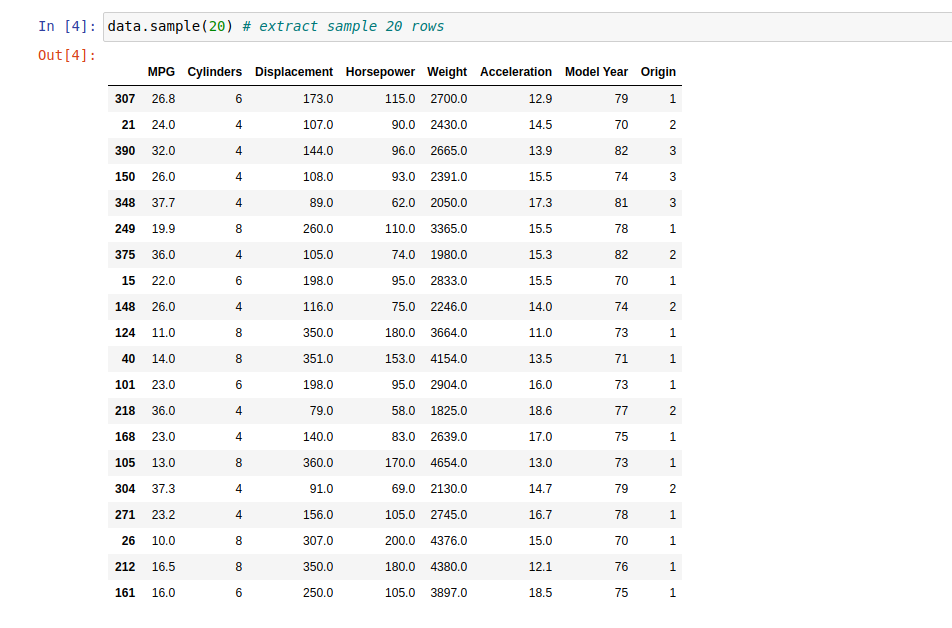

# Auto MPG Prediction

## Problem Statement

The data containes MPG variable which is continuous data and tells us about the efficiency of fuel consumption of a vehicle in 70s and 80s

Our aim here is **to predict the MPG value for a vehicle given we have other atributes of that vehicle**.

## Data



## How to use deployed model:

The model is save in the file `model.bin` using _pickle_ library. It is then hosted on **Heroku**.

Use this link to make predictions by passing the vhicle configuration in json format: `https://predict-fuel-efficiency.herokuapp.com/`

Example configuration:

vehicle_config = {

    'Cylinders': [4, 6, 8],

    'Displacement': [155.0, 160.0, 165.5],

    'Horsepower': [93.0, 130.0, 98.0],

    'Weight': [2500.0, 3150.0, 2600.0],

    'Acceleration': [15.0, 14.0, 16.0],

    'Model Year': [81, 80, 78],

    'Origin': [3, 2, 1]
    
}

Request the URL:

```python
import requests

url = "https://predict-fuel-efficiency.herokuapp.com/"
r = requests.post(url, json=vehicle_config)
r.text.strip()
```

**Output**:

```
'{"mpg_predictions":[26.139999999999997,26.550000000000004,19.129999999999995]}'
​```

Refer [this](https://github.com/soumyaa1804/auto_mpg_prediction/blob/master/auto_MPG_Part2.ipynb) Jupyter Notebook for code snippets.
